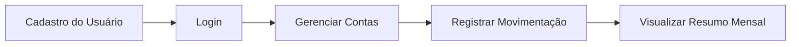

# SeuBarrigaTestes
Testes do site Seu Barriga - Projeto Atlântico Avanti Bootcamp 2025.3

# 🧪 Projeto de Testes - Bootcamp QA Avanti

Este repositório contém os testes manuais e automatizados desenvolvidos durante o Bootcamp de QA da Avanti.  
O projeto teve como objetivo aplicar práticas de garantia de qualidade, documentação, mapeamento de fluxo, escrita de casos de teste e automação utilizando **Cypress**.

---

## 🚀 Funcionalidades Testadas

- Cadastro de usuário
- Login e autenticação
- Cadastro e gerenciamento de contas
- Criação, edição e exclusão de movimentações financeiras
- Visualização de resumo mensal

---

## ✅ Resultados dos Testes

| Tipo de Teste       | Quantidade | Status  |
|--------------------|-----------:|--------|
| Casos de Teste     | 55         | Criados e Executados |
| Testes Aprovados   | 43         | ✅ Sucesso |
| Testes Reprovados  | 12         | ❌ Necessitam correção |
| Cobertura Geral    | 78,2%      | 📊 Estável |

Prioridade dos cenários:
- **Alta:** 21 casos
- **Média:** 24 casos
- **Baixa:** 10 casos

---

## 🔄 Fluxo do Usuário (Visão Geral)


---

## 🤖 Automação com Cypress
**Tecnologias utilizadas**

- Cypress (Testes End-to-End)
- JavaScript
- Node.js
- Faker.js (Geração de dados dinâmicos)

---

## 🧠 Como Rodar o Projeto

```bash

# Clone o repositório
git clone https://github.com/talyoliv/SeuBarrigaTestes

# Acesse o diretório
cd SeuBarrigaTestes

# Instale as dependências
npm install

# Execute o Cypress
npx cypress open

```
---

## 🎯 Principais Aprendizados

- Escrita clara e objetiva de casos de teste
- Priorização baseada em criticidade
- Report de bugs com evidências
- Reutilização de código com custom commands
- Automação com geração de dados dinâmicos
- Integração contínua com GitHub Actions ✅

---

## ✨ Agradecimento

"Minha gratidão a cada pessoa que contribuiu para este projeto.
Mais do que uma entrega, ele representa crescimento, colaboração e uma história que agora faz parte de quem nos tornamos."

---

## 📌 Autora

Talita Gomes
Analista de QA em construção, apaixonada por qualidade, experiência do usuário e evolução contínua.


